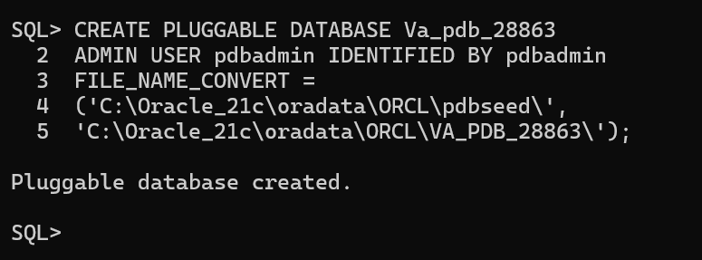
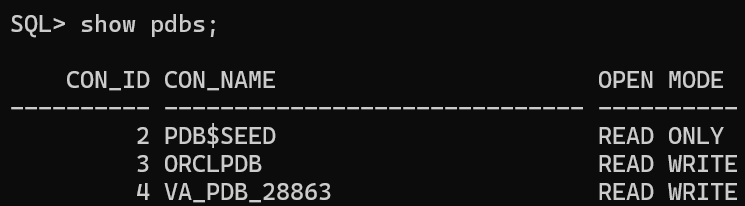
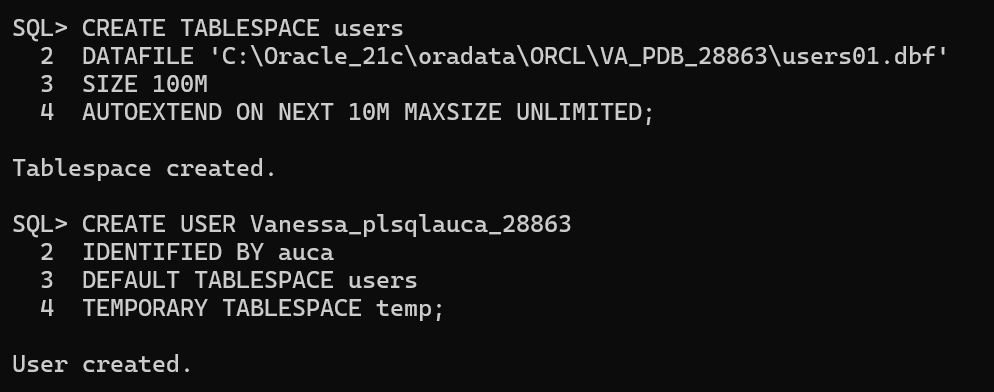
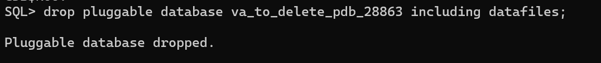
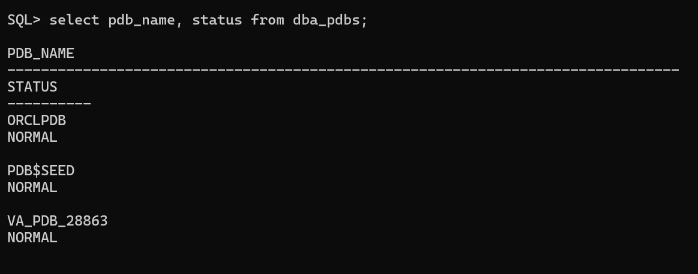
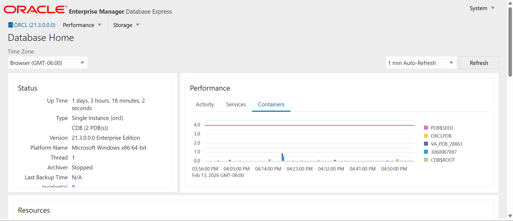

# Oracle Pluggable Database_Assignment II

**Name:** Gihozo Uwase Vanessa

**ID:** 28863

**Wednesday-Group A**

**Course:** Database Development with PL/SQL

**Instructor:** Eric Maniraguha 

**Date:** 14 February 2026

## Task Overview

This assignment focused on *Oracle Multitenant Architecture*, specifically the creation, management, and monitoring of *Pluggable Databases (PDBs)*.

The main objectives of this assignment were to:

- Understand how PDBs operate within a Container Database (CDB)

- Practice creating and deleting PDBs using SQL

- Monitor database performance using Oracle Enterprise Manager (OEM)

- Document database administration activities professionally

## Oracle Environment Used

| Component       | Details                                   |
| --------------- | ----------------------------------------- |
| Database        | Oracle Database 21c                       |
| Architecture    | Multitenant (CDB & PDB)                   |
| Tools           | SQL*Plus, Oracle Enterprise Manager (OEM) |
| OS              | Windows                                   |
| User Privileges | SYSDBA                                    |

## Task Expounded 

### Task 1: Pluggable Database (PDB) Creation

In this task, a new Pluggable Database was created within an existing Container Database (CDB).

The process involved:

- Connecting as a SYSDBA user so as to get a path of creating a new PDB

- Executing CREATE PLUGGABLE DATABASE

- Opening the PDB and saving its state

- Verifying creation using SHOW PDBS

- Creation of user inside PDB

### Task 2: Pluggable Database (PDB) Deletion

This task involved creating a new pluggable databse and safely removing it.

Steps followed:

- Closing the new created PDB first before deletion.

- Unplugging or dropping the PDB.

- Deleting associated data files.

- Confirming removal from the CDB using select syntax.

### Task 3: Oracle Enterprise Manager (OEM) Monitoring

Oracle Enterprise Manager was used to monitor:

- Database status: understanding of database performance and health indicators

- PDB availability: awareness of real-world DBA responsibilities

- Resource usage: ability to use enterprise-level database monitoring tools

- Overall system health

This task demonstrates real-world database administration and monitoring skills.

## Challenges Faced & Solutions

| Challenge	                            | Solution                                |
|---------------------------------------|-----------------------------------------|
| PDB not opening after creation        |	Used ALTER PLUGGABLE DATABASE OPEN;     |
| Confusion between CDB and PDB context |	Used SHOW CON_NAME; to confirm context  |

## Integrity Statement

I hereby declare that this assignment is entirely my own work. All tasks were completed independently, and no part of this work has been copied or plagiarized.

Repository Link: https://github.com/Vanessa30477/oracle_pdb_ass_II_28863_Gihozo/tree/main
PDB Name Created: Va_pdb_28863
Issues Encountered: Yes
